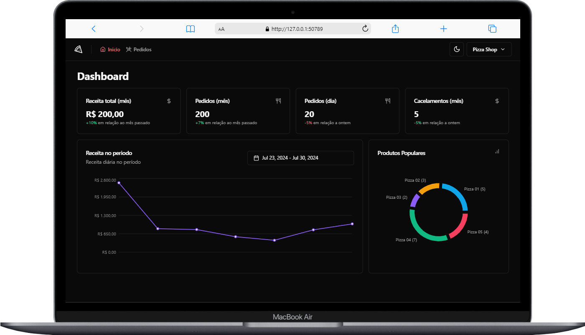
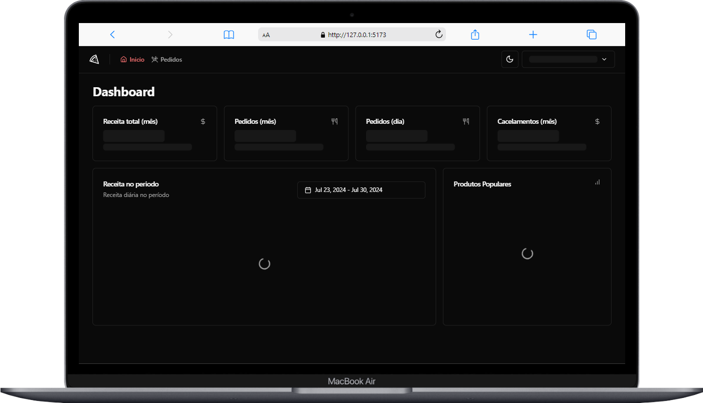
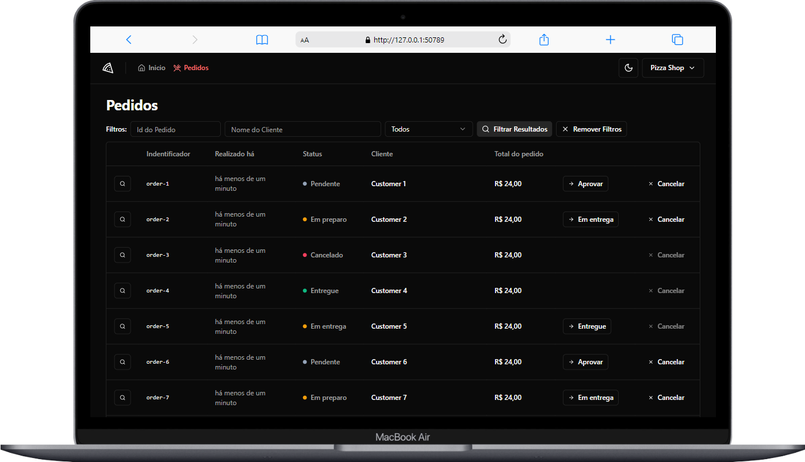
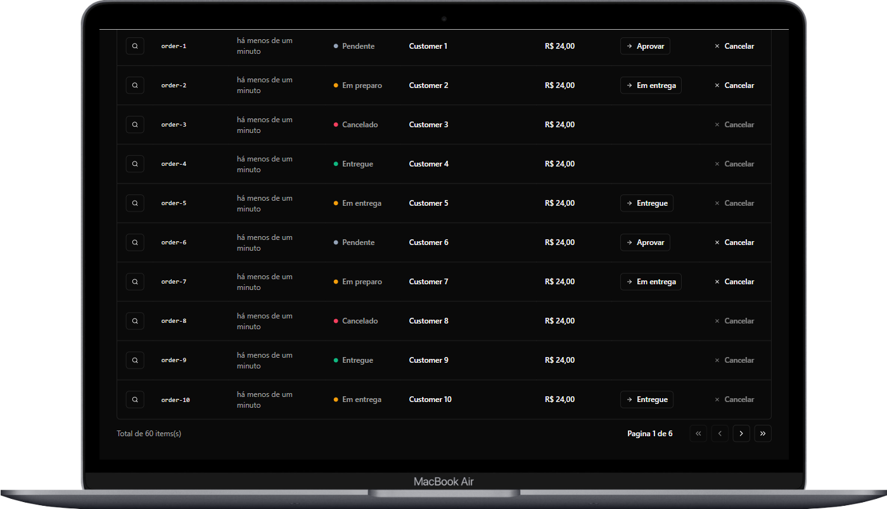
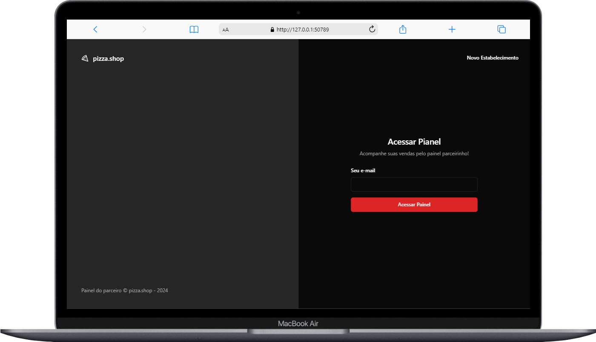
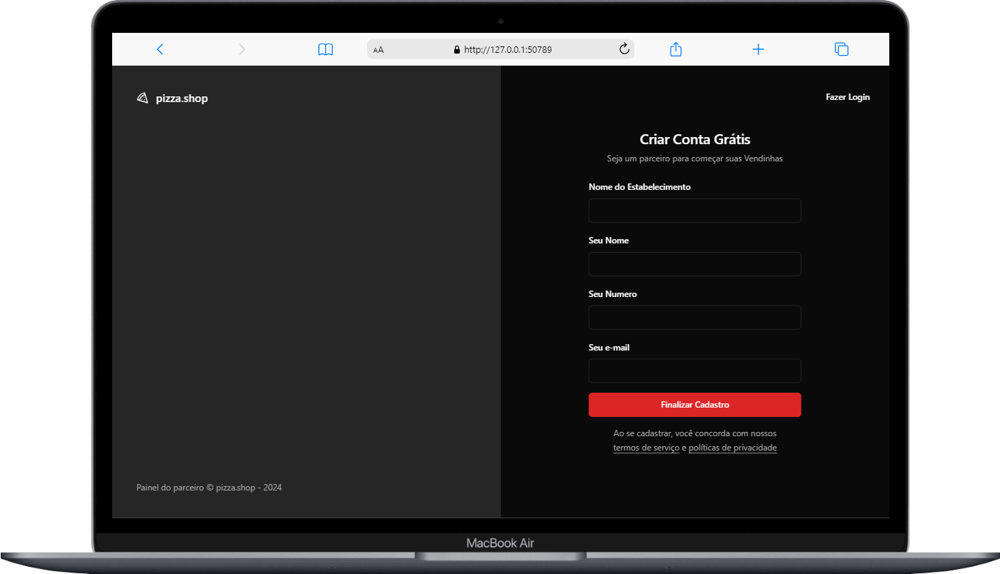

<div display="flex" align="center">
    
</div>
- warning ! the api was develpement per rocketseat, repositori cloning per me
- git backend : https://dt-money-rocketseat-brenookra.netlify.app

## 🚀 Projeto Finalizado 

## 🚀 Techniques

this project was developed with technology:

- REACTJS E VITE
- radix-ui
- date-fns
- zod
- Tailwind CSS
- react-hook-form
- React-helmet
- Recharts
- happy-dom
- Axios
- MSW
- Testing Library
- playwright

## learning main

- Recharts
- happy-dom
- MSW
- Testing Library
- playwright

## 💻 Photos Project

<div align="center">
    <h3>Home </h3>
    
    <h3>Home Loading </h3>
    
    <h3>Orders</h3>
    
      <h3>Orders Navigation</h3>
    
      <h3>Login</h3>
    
      <h3>Create Restaurante</h3>
    
  
</div>

<p> para rodar o backend, primeiro criar container docker </p>
<p> isso faz com que o docker inicialize os containers da aplicação </p>

```bash
 docker compose up -d
```

<p> depois de instalado o bun, use bun i para instalar os package </p>

```bash
 bun i
```

<p> agora rodamos o bun migrate </p>

```bash
 bun migrate
```

<p> agora bun seed para criar os gerentes da aplicação </p>

```bash
 bun seed
```
<p> agora bun dev para rodar o backend</p>

```bash
 bun dev
```

## ❗ Importante ❗

<p>o quando o login for feito, o backend recebe uma url com o acesso a home</p>